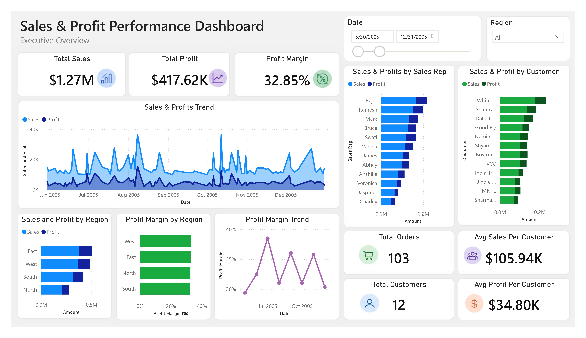
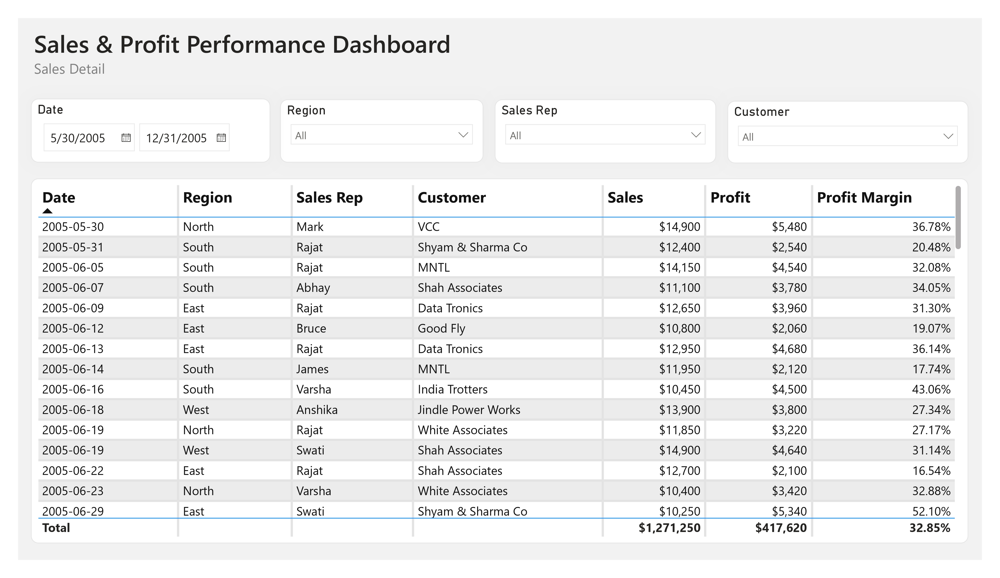

# 📈 Sales & Profit Dashboard

An interactive Power BI dashboard designed to monitor sales performance, profitability, customer activity, and business performance through dynamic visualizations and drill-down reporting.

---

# 📖 Project Overview

This project showcases an interactive Power BI dashboard built for business performance monitoring. It provides a centralized view of key sales and profitability metrics, allowing users to explore business performance through interactive filters and detailed transaction reports.

The dashboard is designed to support business users in tracking sales trends, evaluating profitability, and identifying top-performing products and regions.

---

# 📊 Dashboard Preview

## Executive Overview

---

## Sales Detail Report

---

# 🚀 Dashboard Features

- Executive KPI dashboard
- Interactive filtering and cross-highlighting
- Sales and profit monitoring
- Profit margin tracking
- Product performance analysis
- Regional sales comparison
- Customer sales analysis
- Transaction-level detail report
- Drill-through reporting

---

# 📈 Key Performance Indicators

- Total Sales
- Total Profit
- Profit Margin
- Total Orders
- Total Customers
- Average Sales per Customer
- Average Profit per Customer

---

# 🛠 Tools & Technologies

- Power BI Desktop
- Power Query
- DAX
- Excel

---

# 📂 Repository Contents

| File | Description |
|------|-------------|
| `Sales_Profit_Dashboard.pbix` | Power BI dashboard |
| `Sales_Profit_Dashboard.pdf` | Dashboard report |
| `Sales_Dataset.xlsx` | Source dataset |
| `01_Executive_Overview.jpg` | Dashboard overview |
| `02_Sales_Detail.jpg` | Detailed sales report |

---

# 📌 Notes

If the PBIX file cannot locate the data source after download:

1. Open the PBIX file.
2. Go to **Transform Data → Data Source Settings**.
3. Click **Change Source**.
4. Select the included **Sales_Dataset.xlsx** file.
